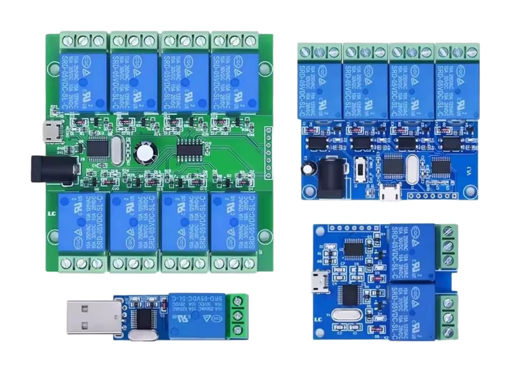

# USB Relay for Home Assistant

Custom integration for controlling USB relay modules (CH340) via Home Assistant.
This cheap USB board embbeded 1 to 8 relay, controlled by a simple serial protocol.
USB to serial is done with CH340, operating at 9600/8N1.

## Installation via HACS

1. Add this repository in HACS > Integrations > Custom Repositories:
   - URL: `https://github.com/globoudou/home-assistant-usb-relay`
   - Type: Integration
2. Install "USB Relay".
3. Restart Home Assistant.
4. Add the integration via Configuration > Devices & Services > Add Integration > USB Relay.
5. Enter the USB port and number of relays.

## Protocol

Simple send hex bytes over serial port :
- Read state: `0xFF` → returns n bytes (0 or 1).
- Change state: `0xA0 relay_id state checksum`

## License

MIT
