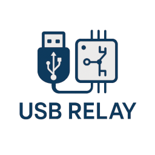
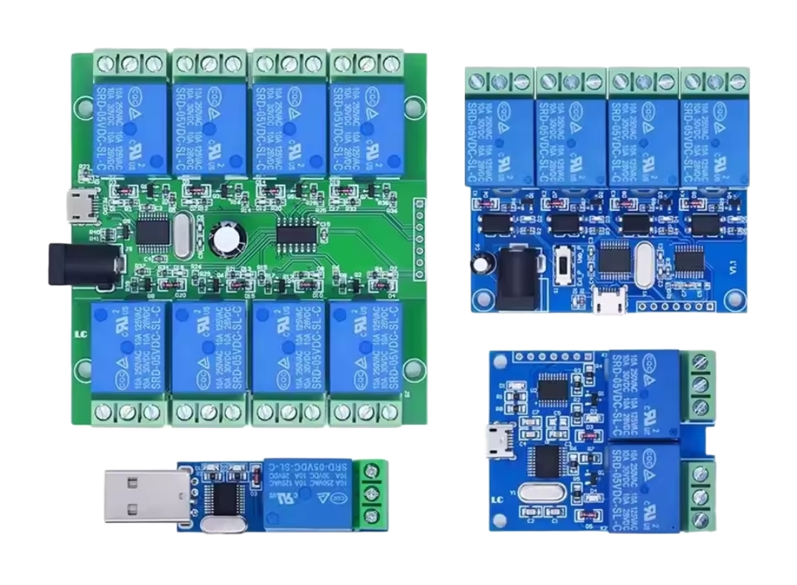

# USB Relay for Home Assistant

[](https://github.com/hacs/integration)
[](https://github.com/globoudou/home-assistant-usb-relay/actions/workflows/validate.yml)

Custom integration for controlling cheap USB relay boards (1 to 8 relays) from Home Assistant.
The board uses a CH340 USB-to-serial chip at 9600 baud, 8N1, with a simple serial protocol.



## Features

- Lists the serial ports without opening them; only the port you select is queried, and the number of relays is read from the board.
- One `switch` entity per relay, grouped under a single device.
- Uses the stable `/dev/serial/by-id/...` path when available, so the board survives USB re-enumeration.

## Requirements

Home Assistant 2026.11 or later.

The only Python library used is [pyserial](https://pypi.org/project/pyserial/). Home Assistant itself depends on it
(`pyserial==3.5`), so it is not listed in the manifest `requirements`: hassfest rejects a requirement that is
already a dependency of Home Assistant.

## Installation

### Marketplace

1. Search & Install **USB Relay**.
2. Restart Home Assistant.

### Manual

Copy `custom_components/usb_relay/` into `config/custom_components/`, then restart Home Assistant.

## Configuration

1. Plug in the relay board.
2. Go to **Settings → Devices & services → Add integration → USB Relay**.
3. Pick the serial port of the board (CH340 adapters are listed first). Only that port is queried, to check that a relay board answers and to read its number of relays.
4. Confirm the number of relays.

## Protocol

Hex bytes sent over the serial port:

- Read state: `0xFF` → the board answers with one byte per relay (`0x00` off, `0x01` on).
- Switch a relay: `0xA0 relay state checksum`, with relays numbered from 1 and `checksum = (0xA0 + relay + state) & 0xFF`.
  For example `0xA0 0x02 0x01 0xA3` turns relay 2 on.

## Development

```bash
pip install pytest-homeassistant-custom-component pyserial
pytest
```

## License

MIT
